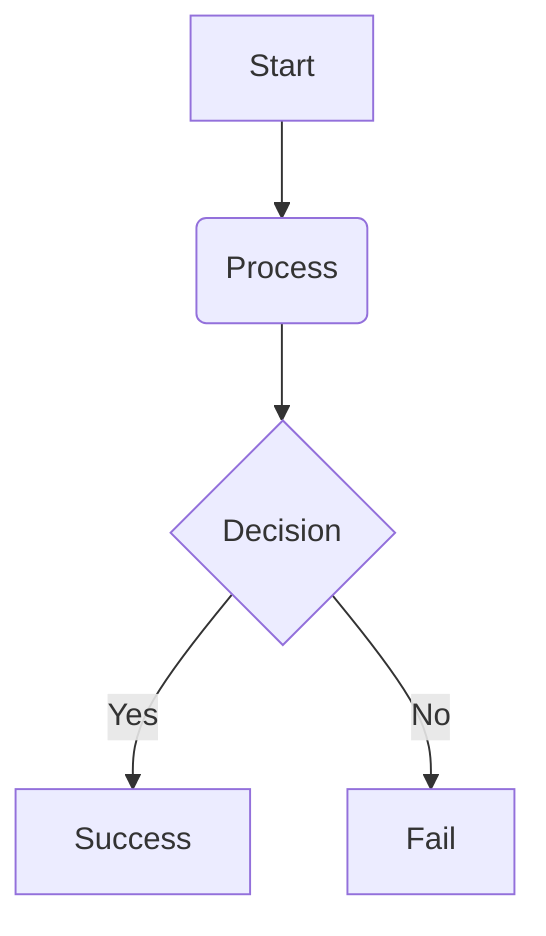

Nexus HR & Payroll SystemAn enterprise-grade, full-stack HR and Payroll management solution built with Java Spring Boot, Spring Data JPA, H2, and a modern Tailwind-powered glassmorphic interface. This system orchestrates and automates employee onboarding, leave management, automated payroll generation (with dynamic deduction calculations), and administrative real-time analytics.🏗 System ArchitectureThe project is designed using the MVC (Model-View-Controller) pattern, strictly separating concerns between the presentation layer, business logic, and database state management.

