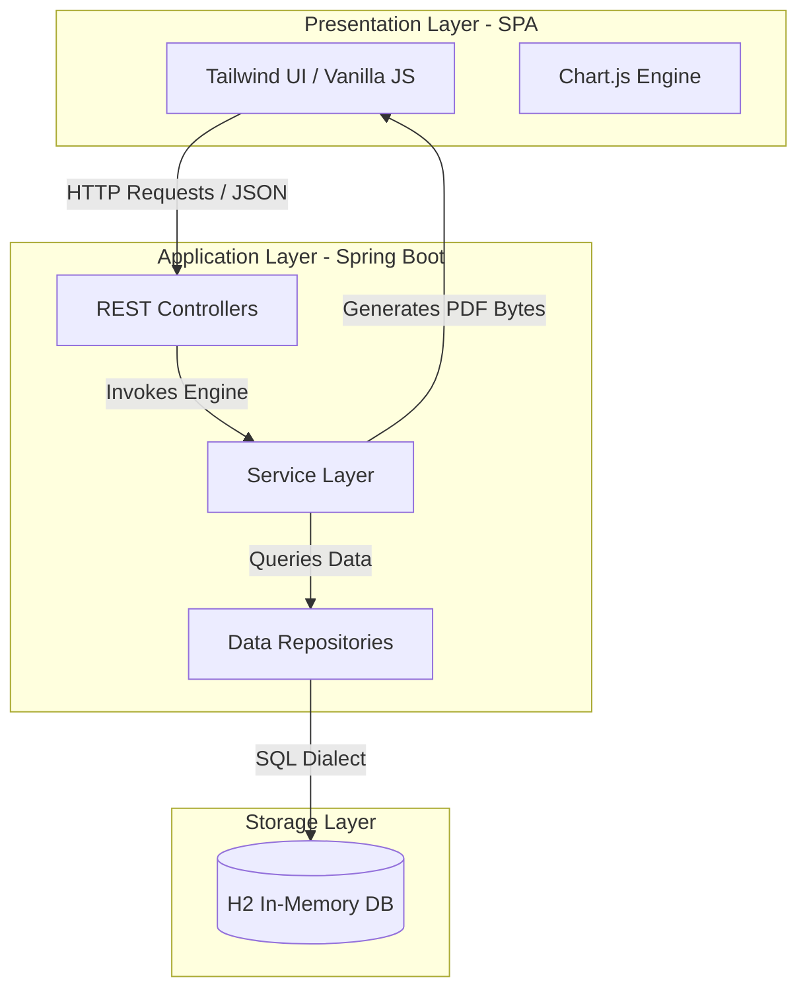

# HR & Payroll System
An enterprise-grade, full-stack HR and Payroll management solution built with Java Spring Boot, Spring Data JPA, H2, and a modern Tailwind-powered glassmorphic interface. This system orchestrates and automates employee onboarding, leave management, automated payroll generation (with dynamic deduction calculations), and administrative real-time analytics.

## System Architecture
The project is designed using the MVC (Model-View-Controller) pattern, strictly separating concerns between the presentation layer, business logic, and database state management.



## Key Features
* **Secure Authentication Module:** Dedicated backend verification system utilizing unique assigned 6-digit random Employee IDs and matching string passwords,
  persisting session state securely on client-side routing.
  
* **Leave Management Engine:** Custom multi-category balance tracking (Sick, Casual, Unpaid). Implements an authorization queue workflow featuring a custom-built
  frosted glass "Reason for Rejection" modal allowing managers to provide feedback.
  
* **Automated Payroll Calculations:** Dynamic calculation service that tracks approved unpaid leaves, handles tax deductions, saves generated payroll receipts, and  exports raw bytes to print dynamic PDF payslips on-the-fly.
  
* **Real-time Analytics Dashboard:** Uses Chart.js to translate repository datasets into intuitive administrative visualizations (Doughnut charts representing
  leave distribution and Bar charts showing headcount density across departments).
  
* **1-Click HR CSV Export:** Instantly parses internal database state to generate structured CSV reports of personnel profiles, roles, salaries, and leave tracking
  balances.
  
* **Sleek Slate/Midnight UI:** Clean, ultra-professional glassmorphic interface featuring heavily blurred modern gradient backdrops, crisp grid layouts, minimal
  SVG SVG-Heroicons, and responsive design systems.


 ## Core Calculation Logic
The `PayrollService` evaluates monthly net salary structures based on the following mathematical rules:

Let $S_{base}$ represent the Employee's annual base salary, $D_{unpaid}$ represent the count of approved unpaid leave days during the billing cycle, and $R_{day}$ represent the calculated daily rate of pay:

$$
R_{day} = \frac{S_{base}}{30}
$$

The deduction applied for taking unpaid time off ($Ded_{unpaid}$) is modeled as:

$$
Ded_{unpaid} = D_{unpaid} \times R_{day}
$$

A flat rate of $10\%$ income tax ($T$) is evaluated from the adjusted basic salary:

$$
T = S_{basic} \times 0.10
$$

The ultimate calculated Net Monthly Salary ($S_{net}$) disbursed to the employee is defined as:

$$
S_{net} = S_{basic} - T
$$

## Database Schema (Entities)
The JPA entity relationships map to three primary logical tables in the embedded engine:

1. `Employee`

| Field | Type | Modifier | Description |
| --- | --- | --- | --- |
| id | Long | @Id (Assigned 6-Digit ID) | Unique PK generated on service level |
| name | String | Not Null | Complete legal name |
| email | String | Unique, Not Null | Work email address |
| password | String | Not Null | Secure plain-text string |
| department | String | - | Organizational division |
| role | String | - | Job role title |
| baseSalary | Double | - | Monthly standard salary rate |
| sickLeaveBalance | int | Default: 12 | Tracking counter |
| casualLeaveBalance | int | Default: 15 | Tracking counter |

2. `Leave`

| Field | Type | Modifier | Description |
| --- | --- | --- | --- |
| id | Long | @GeneratedValue | Primary Key |
| employee | Employee | @ManyToOne (Not Null) | Associated foreign key relation |
| startDate | LocalDate | Not Null | Leave epoch start date |
| endDate | LocalDate | Not Null | Leave epoch end date |
| leaveType | String | - | SICK, CASUAL, or UNPAID |
| status | String | Default: PENDING | Current state of request |
| rejectionReason | String | Limit: 500 characters | Feedback if request is declined |

3. `Payroll`

| Field | Type | Modifier | Description |
| --- | --- | --- | --- |
| id | Long | @GeneratedValue | Primary Key |
| employee | Employee | @ManyToOne (Not Null) | Disbursed to employee relationship |
| salaryMonth | String | - | String Representation of Month |
| salaryYear | int | - | Numeric Year target |
| basicSalary | Double | - | Standard pre-tax threshold |
| taxDeduction | Double | - | Sum of income tax + unpaid days penalty |
| netSalary | Double | - | Final pay-out amount |

## REST API Specifications

The core engine exposes the following structured JSON endpoints:

### Employee Management
* `GET /api/employees`
    - Description: Retrieves all personnel profiles.

* `POST /api/employees`
    - Payload: { `"name": "...", "email": "...", "password": "...", "department": "...", "role": "...", "baseSalary": 50000` }
    - Description: Provisions a new employee with an auto-generated unique random 6-digit ID.

* `POST /api/employees/login`
    - Payload: { `"id": 102948, "password": "..."` }
    - Description: Validates user credentials. Returns the authentic Employee payload or returns HTTP 401 Unauthorized.

* `GET /api/employees/export`
    - Description: Fetches a raw stream of current personnel data parsed into a .csv file attachment download.

### Leave Tracking
* `POST /api/leaves/request`
    - Payload: { `"employee": { "id": 102948 }, "startDate": "YYYY-MM-DD", "endDate": "YYYY-MM-DD", "leaveType": "..."` }
    - Description: Commits a new pending leave request into processing.
  
* `GET /api/leaves/employee/{employeeId}`
    - Description: Retrieves the comprehensive leave logging history associated with a specific employee.

* `PUT /api/leaves/{leaveId}/status`
    - Parameters: `status` (Required, e.g. "APPROVED" or "REJECTED"), `reason` (Optional string)
    - Description: Authorizes or declines a request. Deducts leave balances accordingly on approval, or appends the reason on rejection.

### Payroll & Documents
* `POST /api/payroll/generate/{employeeId}`
    - Parameters: `month` (e.g. "August"), `year` (e.g. 2026)
    - Description: Invokes calculations, parses unpaid day counts, and generates a payroll record.

* `GET /api/payroll/employee/{employeeId}`
    - Description: Retrieves historical slip records.

* `GET /api/payroll/{payrollId}/download`
    - Description: Generates and compiles a structural PDF payload representing an official company pay slip for instant printing/download.

## Installation & Launch Guide

### Prerequisites
* Java Development Kit (JDK): Version 17 or higher.
* Apache Maven: (If not using the Maven Wrapper ./mvnw).
* Modern Web Browser: Chrome, Edge, Safari, or Firefox.

Step 1: Clone the Codebase
```
git clone https://github.com/DharmeshBaghel/HR_Payroll_System.git
cd HR_Payroll_System
```

Step 2: Configure Application Settings
Make sure to create an `application.properties` file in `src/main/resources/` (Ensure this isn't checked into your public Git index using your `.gitignore` configuration):
```
# App Config
spring.application.name=NexusHR
server.port=8080

# Database Layer (In-Memory H2)
spring.datasource.url=jdbc:h2:mem:nexushrdb
spring.datasource.driverClassName=org.h2.Driver
spring.datasource.username=sa
spring.datasource.password=
spring.jpa.database-platform=org.hibernate.dialect.H2Dialect

# Console Enablement
spring.h2.console.enabled=true
spring.h2.console.path=/h2-console
```

Step 3: Run the Application
Start the embedded Tomcat server via Maven in your terminal:
```
# Windows
mvn spring-boot:run

# macOS / Linux
./mvnw spring-boot:run
````
Once you see the Spring console output log Started `PayrollSystemApplication` in X seconds, the server is running.

Step 4: Access the Frontend Portal
Open your web browser and navigate directly to:
```
http://localhost:8080/index.html
```
