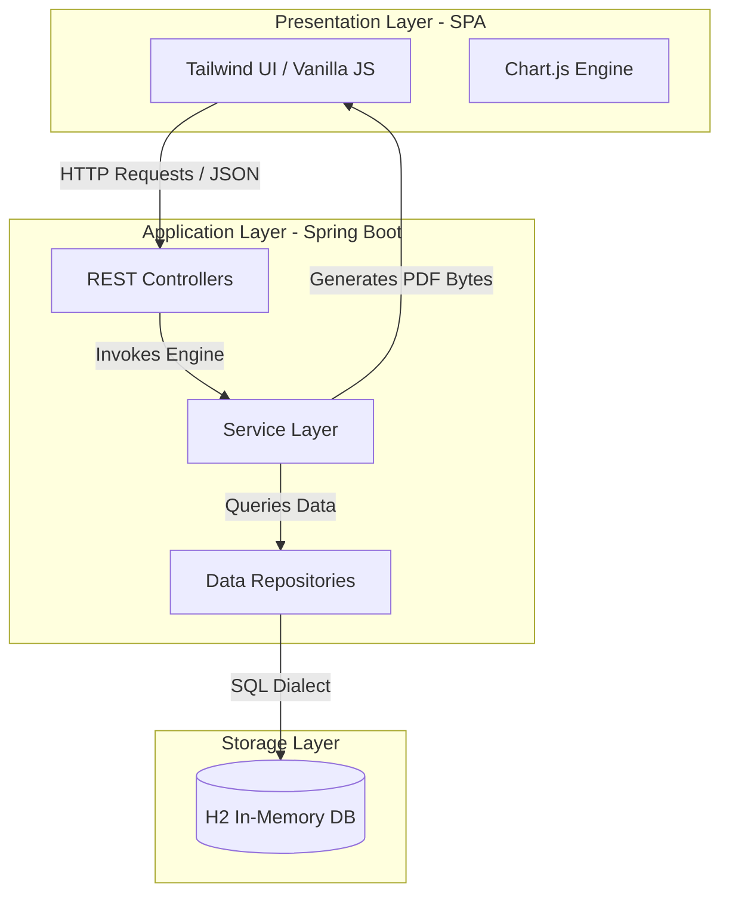

# HR & Payroll System
An enterprise-grade, full-stack HR and Payroll management solution built with Java Spring Boot, Spring Data JPA, H2, and a modern Tailwind-powered glassmorphic interface. This system orchestrates and automates employee onboarding, leave management, automated payroll generation (with dynamic deduction calculations), and administrative real-time analytics.

## System Architecture
The project is designed using the MVC (Model-View-Controller) pattern, strictly separating concerns between the presentation layer, business logic, and database state management.

## Key Features
* **Secure Authentication Module:** Dedicated backend verification system utilizing unique assigned 6-digit random Employee IDs and matching string passwords,
  persisting session state securely on client-side routing.
  
* **Leave Management Engine:** Custom multi-category balance tracking (Sick, Casual, Unpaid). Implements an authorization queue workflow featuring a custom-built
  frosted glass "Reason for Rejection" modal allowing managers to provide feedback.
  
* **Automated Payroll Calculations:** Dynamic calculation service that tracks approved unpaid leaves, handles tax deductions, saves generated payroll receipts, and  exports raw bytes to print dynamic PDF payslips on-the-fly.
  
* **Real-time Analytics Dashboard:** Uses Chart.js to translate repository datasets into intuitive administrative visualizations (Doughnut charts representing
  leave distribution and Bar charts showing headcount density across departments).
  
* **1-Click HR CSV Export:** Instantly parses internal database state to generate structured CSV reports of personnel profiles, roles, salaries, and leave tracking
  balances.
  
* **Sleek Slate/Midnight UI:** Clean, ultra-professional glassmorphic interface featuring heavily blurred modern gradient backdrops, crisp grid layouts, minimal
  SVG SVG-Heroicons, and responsive design systems.

 ## Core Calculation Logic
The `PayrollService` evaluates monthly net salary structures based on the following mathematical rules:

Let $S_{base}$ represent the Employee's annual base salary, $D_{unpaid}$ represent the count of approved unpaid leave days during the billing cycle, and $R_{day}$ represent the calculated daily rate of pay:
